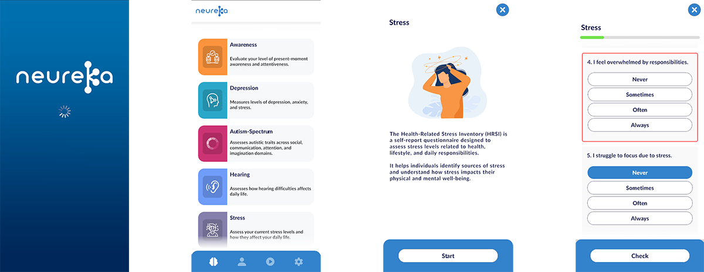

# Neureka Vertical Slice

The original Neureka App was designed to gamify interactive cognitive assessments and collect data using questionnaires and tasks. Its purpose is to collect data that supports research into Dementia and mental health.

This vertical slice demonstrates how modular architecture and dynamic content generation can make an app easy to extend for developers and simple to update for non-technical users.

## Key Features

- UI Toolkit & Fluent UI framework for editor and runtime UI
- Dynamic content generation from JSON/CSV files
- Core services are automatically bootstrapped and persist across scene loads, with full support for single-scene and multi-scene projects.
- Modular architecture with self-contained systems
- Event-driven messaging between modules using a custom message bus, imaginatively named Message Bus 
- Rapid prototyping and experimentation with UI and content
- UI styling is handled via USS, allowing layouts and visual themes to be adjusted, extended, or replaced without modifying code

  
## Core Systems

### File Importer
File Importer, which encompasses the Drag and Drop file importer, the Dispatch Manager, the Parser Manager, and the parsers themselves. This system lets you drag and drop JSON or CSV files into the project, automatically generating the corresponding questionnaire ScriptableObjects which are available for loading by the questionnaire service. 

### Questionnaire Service  
The Questionnaire Service is a bootstrapped service responsible for building and displaying questionnaires. It listens for incoming requests via the Message Bus, loads the correct questionnaire ScriptableObject, and uses its data along with Fluent UI to dynamically construct the questionnaire UI for the user. This system makes adding or updating questionnaires straightforward and keeps the UI fully decoupled from other services.

### Document Service 
In this context, a document represents a self-contained portion of the app, for example, the navigation UI, a game, or an assessment. The Document Service maintains a dictionary of lazy-loaded documents that are dynamically built and loaded only when needed and can be optionally cached for persistent use. Document requests are handled via the Message Bus, and each document builds its own UI and manages its own state. 

### Message Bus
The message bus facilitates communication between all relevant services and coordinates interactions between scene-level systems and the UI, removing the need for direct dependencies.

### Data Upload Service
The Data Upload Service handles requests from other services to upload data to a web server. It saves data locally and then uses a plain C# web service instance to perform the upload. Once the upload is successful, the local copy is deleted. This design separates the Unity-specific service from the web upload logic, keeping the system modular and easily testable.

### Fluent UI
Fluent UI is a lightweight framework built on top of UI Toolkit that uses the Curiously Recurring Template Pattern (CRTP) to implement a fluent builder for low-level UI components like buttons, labels, and containers. It was created as an alternative to UXML, enabling data-driven UI to be built entirely in code, with each component self-contained and independent of the scene. Fluent UI supports both editor and runtime UI.

### Conclusion
This vertical slice demonstrates a modular, event-driven Unity architecture with dynamic content, bootstrapped services, and a flexible UI framework. It highlights how complex functionality can be made easy to extend for developers while remaining accessible for non-technical users.

