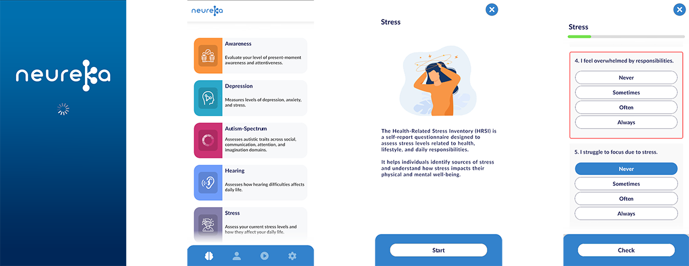

# Neureka Vertical Slice

The original Neureka App was designed to gamify interactive cognitive assessments and collect data using questionnaires and tasks. Its purpose is to support research into dementia and mental health.

The original app was implemented using UGUI, while this vertical slice is built with UI Toolkit and demonstrates how modular architecture and dynamic content generation can make the app easy to extend for developers and simple to update for non-technical users.  

  Click on the above image to view the video demo

 
 

## Key Features

- UI Toolkit & Fluent UI framework for editor and runtime UI
- Dynamic content generation from JSON/CSV files
- Core services are automatically bootstrapped and persist across scene loads, with full support for single-scene and multi-scene projects.
- Modular architecture with self-contained systems
- Event-driven messaging between modules using a custom message bus, imaginatively named Message Bus 
- Rapid prototyping and experimentation with UI and content
- UI styling is handled via USS, allowing layouts and visual themes to be adjusted, extended, or replaced without modifying code

  
## Core Systems

### File Importer
The **File Importer** system includes the Drag and Drop importer, the Dispatch Manager, the Parser Manager, and the parsers themselves. It allows you to drag and drop JSON or CSV files into the project, automatically generating the corresponding **questionnaire ScriptableObjects**, which can then be loaded by the **Questionnaire Service**.
 
  [File Importer Flow (PDF)](Documentation/File_Import_Architecture.pdf)
 
 

### Questionnaire Service  
The Questionnaire Service builds and displays questionnaires for the user. It listens for requests via the **Message Bus**, loads the correct **questionnaire ScriptableObject**, and uses its data with **Fluent UI** to dynamically construct the questionnaire interface.

This design makes adding or updating questionnaires straightforward and keeps the UI fully decoupled from other services.
 
[Questionnaire Service Flow (PDF)](Documentation/Questionnaire_Service_Diagram.pdf)
 
 

### Document Service 
In this context, a document is a self-contained portion of the app — for example, the navigation UI, a game, or an assessment. 

The Document Service manages a collection of documents that are **lazy-loaded**: each document is built and loaded only when needed. Documents can also be **optionally cached** for persistent use. 

All document requests go through the **Message Bus**, and each document is responsible for building its own UI and managing its own state.
 
 

### Message Bus
The message bus facilitates communication between all relevant services and coordinates interactions between scene-level systems and the UI, removing the need for direct dependencies.
 
 

### Data Upload Service
The Data Upload Service handles requests from other services to upload data to a web server. It saves data locally and then uses a plain C# web service instance to perform the upload. Once the upload is successful, the local copy is deleted. This design separates the Unity-specific service from the web upload logic, keeping the system modular and easily testable.
 
 

### Fluent UI
Fluent UI is a lightweight framework built on top of UI Toolkit that uses the Curiously Recurring Template Pattern (CRTP) to implement a fluent builder for low-level UI components like buttons, labels, and containers. It was created as an alternative to UXML, enabling data-driven UI to be built entirely in code, with each component self-contained and independent of the scene. Fluent UI supports both editor and runtime UI.
 
 

### Haptics 
A custom Java plugin I built that gives direct access to an Android device’s vibration functionality. Unlike Unity’s basic vibrate call, it lets me control the duration and intensity of the vibration, giving more flexibility for feedback in the app.
 
 

## Conclusion
This vertical slice demonstrates a modular, event-driven Unity architecture with dynamic content, bootstrapped services, and a flexible UI framework. 

